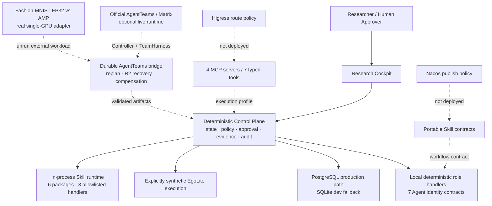

# EgoAgentOS ResearchOps

> Evidence-Gated Multi-Agent Research Infrastructure for Embodied AI  
> 把「提出想法」变成可审批、可复现、可独立验证、可积累的研究生产链。

EgoAgentOS 不是泛化聊天式 AI Scientist。它聚焦具身智能实验室里最难治理的一段流程：

```text
Research Goal → Context → Hypothesis / Plan → Approval → Execution
→ Observation → Deterministic Evaluation → Independent Verification
→ Decision → Archive → Memory Candidate → Independent Validation
→ Validated Memory / Skill Candidate
```

系统采用 **Deterministic Core + LLM Residual**：Agent 可以理解目标、提出假设和解释结果；状态迁移、风险策略、审批范围、指标计算、证据完整性、哈希与审计由确定性代码执行。Planner、Executor、Evaluator、Reviewer 相互分离，任何 Agent 都不能自证闭环。

## 复赛评委一键路径

在线静态 Demo：[https://mythrise.github.io/ego_agent_infra/](https://mythrise.github.io/ego_agent_infra/)

GitHub Pages 使用浏览器内确定性回放，可以步进或 autorun，并完整演示 R2 审批锁、`7/7 · HOLD → PASS`、`KEEP` 决策与移动端导航。页面与所有数据始终标记为 **SYNTHETIC / STATIC REPLAY**；该托管版本不调用后端 API、MCP、AgentTeams、Higress、Nacos 或 GPU，也不产生真实审批签名。它展示的是本仓库可复现控制语义的公开 fixture，不是在线研究运行证明。

静态构建可在本地复现：

```bash
VITE_STATIC_DEMO=true VITE_BASE_PATH=/ego_agent_infra/ npm --prefix apps/web run build
```

`.github/workflows/pages.yml` 会在 `main` 分支推送后使用锁定依赖运行 Web 测试、构建 `/ego_agent_infra/` 基路径 artifact，并部署到 GitHub Pages。`dist/404.html` 由构建脚本生成，用于 SPA 路径回退。

完整本地 API 模式与静态回放共用同一个 Research Cockpit：未强制设置 `VITE_STATIC_DEMO=true` 时，Web 会先连接 `VITE_API_ROOT`；只有在初始连接不可达时才自动降级为静态回放。一旦已连接本地 API，后续故障会显式报错，不会悄然切换成 fixture。

本地评委复现的目标路径只需要 Docker：

```bash
cp .env.example .env
# 分别执行 `openssl rand -hex 32`，为以下五项填入互不复用的值：
# EGO_POSTGRES_PASSWORD、EGO_RUNTIME_PASSWORD、
# EGO_AGENTTEAMS_RUNTIME_PASSWORD、EGO_OPERATOR_KEY、
# EGO_AGENTTEAMS_BRIDGE_OPERATOR_KEY
# 仅为本地浏览器 synthetic Judge Replay，将 EGO_ALLOW_UNAUTHENTICATED_DEMO 改为 true
docker compose up --build
```

打开：

- Research Cockpit：<http://localhost:4173>
- OpenAPI：<http://localhost:8000/docs>
- Health：<http://localhost:8000/api/v1/health>

默认场景明确标记为 **SYNTHETIC DEMO DATA**。它真实运行控制面、PostgreSQL 16 状态、审批、哈希、评测、证据门禁与审计，但不会声称已经使用 8×RTX 4090 训练，也不会伪造 PolarDB/PITR、AgentTeams、Nacos 或 Higress 在线状态。生产数据路径是 PostgreSQL；直接启动 API 且不设置 `EGO_DATABASE_URL` 时，才使用 SQLite 开发 fallback。

截至 2026-08-29，本机已通过 `docker compose config` 和真实 PostgreSQL 16.14
数据层的 32/32 集成测试；API/Web 镜像构建在拉取 Docker Hub metadata 时网络超时，
因此本仓库不把这次 `docker compose up --build` 记作已验证镜像构建。评委网络可用时可
直接走上述一键路径；原生启动路径不依赖镜像拉取：

若不使用 Docker：

```bash
python3 -m venv .venv
. .venv/bin/activate
python -m pip install -e '.[dev]'
export EGO_OPERATOR_KEY="$(openssl rand -hex 32)"
export EGO_OPERATOR_ID=local.judge
# 仅开放固定 demo.operator 身份的 synthetic 路径；live 写接口仍必须带 Bearer key
export EGO_ALLOW_UNAUTHENTICATED_DEMO=true
uvicorn apps.api.main:app --host 127.0.0.1 --port 8000

npm --prefix apps/web ci
VITE_API_ROOT=http://127.0.0.1:8000/api/v1 npm --prefix apps/web run dev -- --port 4173
```

启动后可先用新增协议与 Skill API 做 30 秒自检：

```bash
curl --fail http://127.0.0.1:8000/api/v1/rxp/schemas
curl --fail http://127.0.0.1:8000/api/v1/rxp/demo
curl --fail http://127.0.0.1:8000/api/v1/skills
```

`POST /api/v1/rxp/verify` 会重新校验上传 ledger 的 schema、因果链、root chain、
Evidence Gate 与矩阵完整性；`POST /api/v1/skills/{name}/invoke` 支持 version/package
digest pin，`GET /api/v1/skill-invocations/{invocation_id}` 返回关联 trace。完整可复制
请求见 [评委复现手册](docs/demo-runbook.md)。

## 本地 API 模式：6 分钟 Judge Replay

以下流程针对 `docker compose` 或原生 FastAPI 启动的本地控制面；在 GitHub
Pages 静态 Demo 中，同样的操作只会生成浏览器内 synthetic grant 与 fixture
状态，不会签发服务端 token。

1. 点击 **Reset demo**，确认页面始终显示 `SYNTHETIC DEMO`。
2. 点击 **Run to next gate**。流程会持久化推进到 `APPROVAL`，而不是直接完成。
3. 在审批中心核对 R2、8 GPU / 24 GPU·hour 预算、精确 action digest、15 分钟有效期与回滚点。未审批时执行按钮保持锁定。
4. 点击 Approve。浏览器只在当前会话保存服务端一次性返回的 scope-bound token。
5. 再次点击 **Run to next gate**，确定性角色处理器会推进 Execute → Observe → Evaluate → Verify → Decide → Archive → Memory/Skill → Completed。
6. 查看 baseline/candidate 原始样本、固定种子 paired bootstrap、7/7 Evidence Ledger、独立 Reviewer、hash-chained audit 与 `KEEP` 决策。
7. 打开 Memory/Skill：验证过的过程记忆只有 1/3 支持度，仍为 candidate，未伪装成已发布 Nacos Skill。
8. 可通过 API 将 reset 场景改为 `insufficient_evidence`；该分支故意缺少 trace，并在 VERIFY 阻断决策。

完整讲解见 [docs/demo-runbook.md](docs/demo-runbook.md)。

## 架构



实线是当前本地运行路径；虚线是需显式配置的 execution profile。Skill runtime 可经
本地 API 独立调用，但默认 Web replay 不调用 AgentTeams、Skill runtime 或 MCP，也
不会把角色标签冒充成真实 Matrix 会话。仓库现已包含可执行的 AgentTeams bridge，
但只有真实 Controller、Team、Worker、Matrix 和非 synthetic Ego task 全部握手成功时
才标记 `live`。

任务状态机固定为：

```text
INTAKE → CONTEXT → PLAN → PLAN_REVIEW → APPROVAL → EXECUTE → OBSERVE
→ EVALUATE → VERIFY → DECIDE → ARCHIVE → MEMORY_SKILL → COMPLETED
```

任务 stage 与 run status 分离；所有迁移只能经过 control plane。非法跳转、证据不足、过期/错 scope/重放 token 都会产生结构化错误并保留审计事实。

项目的严格输入/输出见 [输入 / 输出合同](docs/input-output-contract.md)。设计详解：[architecture](docs/architecture.md) · [评委意见落实清单](docs/judge-feedback-implementation.md) · [PostgreSQL / recovery](docs/postgres-recovery-runbook.md) · [state machine](docs/state-machine.md) · [security](docs/security.md) · [observability](docs/observability.md) · [evaluation](docs/evaluation.md)

## 7 个 Agent Identity

| Identity | AgentTeams role | 只负责 | 明确禁止 |
|---|---|---|---|
| Research PI | Manager | 冻结目标、路由、状态/Decision | 修改 raw metrics |
| Scout | Worker | repo/data/历史失败 ContextBundle | 启动训练 |
| Experiment Architect | Worker | 假设、实验矩阵、预算、验伪条件 | 审批自己的方案 |
| Runtime | Worker | allowlisted 提交合同、观测与日志 | 任意 shell |
| Evaluator | Worker | 确定性指标与 bootstrap | 修改 checkpoint |
| Independent Reviewer | Worker | 计划与结果独立审查 | 启动被审实验 |
| Memory Curator | Worker | 只追加 memory candidate 与 Skill candidate | 直接写 validated memory 或把推测写成事实 |

机器可读身份位于 [`agents/`](agents/)。官方 `agentteams.io/v1beta1` 资源、契约锁和结构化 envelope 位于 [`integrations/agentteams/`](integrations/agentteams/)，可执行 bridge 位于 [`apps/agentteams_bridge/`](apps/agentteams_bridge/)。AgentTeams/TeamHarness 负责真实协作，EgoAgentOS 仍负责审批、证据验收和最终决策；Matrix 不是授权源。Memory Curator 的候选项必须由独立的确定性 `memory-validator` 在 Evidence Gate 之后晋级，PostgreSQL 权限不允许 Curator 直接写 validated memory。

## 6 个 Skill Package 与可执行 Registry

[`skills/`](skills/) 内含 `research-plan`、`dataset-manifest`、`safe-experiment-runner`、`ablation-analyzer`、`evidence-gate`、`research-memory`。每个包都有：

- 可移植 `SKILL.md` 与项目扩展 manifest；
- typed inputs/outputs、触发条件和依赖；
- 失败状态、风险/审批、幂等性与复用规则；
- draft → review → publish 的诚实发布边界。

本地 reference registry 对 `x.y.z` 版本做严格 SemVer 校验，以 `SKILL.md` 与 manifest
的 canonical SHA-256 固定 package，支持 deterministic canary、activate、retire、
rollback，并为每次调用绑定 correlation ID、input/output digest 与 package digest。
其中 `research-plan`、`dataset-manifest`、`evidence-gate` 有可执行白名单 handler；其余
三个包只可发现，调用时 fail closed。该 registry 当前为进程内实现，生命周期状态和
trace 不会跨进程重启持久化，也不等于已发布到 Nacos。细节见
[`skills/README.md`](skills/README.md)。

## 4 组 MCP / 7 个受限工具

[`mcp_servers/`](mcp_servers/) 使用官方 Python SDK `mcp==2.0.0`：

| Server | Tools | 确定性约束 |
|---|---|---|
| repo | `repo_snapshot`, `repo_read_files` | 只读、trusted root、拒绝 symlink/credential path、redaction |
| dataset | `dataset_create_manifest`, `dataset_verify_manifest` | canonical SHA-256、首次发布后不可覆盖、完整重验 |
| gpu | `gpu_launch_experiment`, `gpu_job_status` | dry-run 默认、枚举 entrypoint、config digest、argv + `shell=False`、R1/R2 policy |
| metrics | `metrics_compare_paired` | 固定种子、2000 次 paired bootstrap |

安装与测试：

```bash
uv sync --python 3.12 --project mcp_servers --extra dev
uv run --python 3.12 --project mcp_servers pytest mcp_servers/tests
```

这里没有万能 `shell(command)`。GPU server 默认不执行；显式开启后也只运行打包的 harmless synthetic worker。四个 server 默认使用 stdio，也支持显式 loopback Streamable HTTP profile；这不等于 Higress 或 AgentTeams 已连接。完整安全合同见 [mcp_servers/README.md](mcp_servers/README.md)。

API 与 GPU MCP 共享 [`contracts/approval-token-v1.json`](contracts/approval-token-v1.json)。设置同一个至少 32 字节的 `EGO_MCP_APPROVAL_HMAC_SECRET` 后，API 审批会签发 MCP 可独立验签、限时且单次消费的 `egoap1` token；跨 Python 3.9/3.12 集成测试覆盖 dry-run 摘要一致、一次受控 synthetic launch 与 replay 拒绝。默认留空时，Web 使用 `egoap_` 会话 token 完成本地控制面 replay，但该 token 不具备 MCP 互操作性。

## 成本受控的真实 GPU 验收工作负载

[`experiments/fashion_mnist_amp/`](experiments/fashion_mnist_amp/) 提供真实 Fashion-MNIST
单 GPU 对照实验：同一 TinyCNN、数据切分与 seed 下比较 FP32 和 AMP，硬性限制为一张
CUDA GPU、最多 900 秒、0.25 GPU·hour 和 100 MiB 数据。adapter 会冻结环境、审批、
AgentTeams/Matrix、原始预测、延迟、显存、独立复核和 Decision 所需的内容摘要，并由
[`semifinal_acceptance/`](semifinal_acceptance/) 组装、离线重验一键验收包。

这条真实 workload 路径已实现并通过 13 个合同/负例测试，但本机没有产生官方
AgentTeams、GPU 或云端运行记录。当前允许状态仅为
`CONTRACT_PASS_ORIGIN_UNVERIFIED`，不得表述为模型改进或 live 实验完成。

## RXP/1：可复现实验承诺与验收协议

[`RXP — Reproducible eXperiment Protocol`](docs/protocols/RXP.md) 把一次实验从
“日志记录”收紧为可执行因果合同：先冻结完整 `MatrixPlan`，再为每个 cell 依次
提交 `Intent → 单次/限 scope/限资源/限时 Grant → Receipt → 原始 Evidence →
独立 Decision`。`MatrixLedger` 同时给出 evidence Merkle root、追加式 ledger root
和 `missing_decisions`，因此不能只 cherry-pick 有利 cell 后声称矩阵完整。

RXP 不替代 MCP、A2A/AgentTeams、Skill、W3C PROV-O 或 MLflow：这些系统可以
承载、生成、映射或存储 RXP 文档；RXP 只负责实验承诺与验收的不变量。reference
package/CLI 和 FastAPI 的 `/rxp/schemas`、`/rxp/demo`、`/rxp/verify` 已可执行；HTTP
入口当前只生成显式 synthetic fixture 或验证上传文档，不把 RXP ledger 写入 task
store，也不是分布式 transparency service。现有任务执行 API 与 GPU MCP 仍使用
`approval-token-v1`。仓库提供一个显式的一次性迁移 adapter，只有旧 token 已被验证
并消费后才会重新签发 RXP Grant。

```bash
python -m protocols.rxp demo -o /tmp/rxp-a.json
python -m protocols.rxp demo -o /tmp/rxp-b.json
cmp /tmp/rxp-a.json /tmp/rxp-b.json
python -m protocols.rxp verify /tmp/rxp-a.json --demo-key
python -m protocols.rxp schema --check
```

四级 determinism 是证据强度而非性能宣传：`D0_UNVERIFIED`、
`D1_INPUTS_BOUND`、`D2_SEEDED_ENV_BOUND`、`D3_BYTE_REPLAY_VERIFIED`。随仓库的
synthetic fixture 对纯 canonical transform 达到 D3；这不代表任意 GPU 训练可
byte-identical。稳定 Python API、Schema、状态机、安全边界与可选 PROV-O 映射见
[完整规范](docs/protocols/RXP.md)，并由 `tests/protocols/` 覆盖。

## Evidence Gate 与安全不变量

Decision 前必须具备且校验七类证据：`code`、`config`、`dataset_manifest`、`log`、`metric`、`trace`、`review`。Reviewer 必须独立；LLM summary 不能代替 raw metric artifact。

- R0：只读动作，自动执行并审计。
- R1：单 GPU、≤2 GPU·hour、sandbox-only bounded mutation。
- R2：多 GPU / 显著计算或数据变更，必须人工审批。
- R3：删除、push main、发布模型、部署等不可逆外部动作，还必须绑定 rollback point。
- approval token 绑定 task generation、scope、action digest、expiry 与 nonce，且只能消费一次。
- RunManifest 以 canonical serialization 绑定 commit、config、dataset、environment、base model 与 seed。
- audit events 追加写入并 hash-chain；错误和工具输出统一做 secret redaction。

威胁模型与测试矩阵见 [docs/security.md](docs/security.md)。

## 测试与提交验收

完整本地测试：

```bash
make install
make test
```

截至 **2026-08-29** 的当前提交快照为 **242 个测试**：API 69、RXP 26、Skills 6、
Semifinal proof 3、Benchmark 29、Acceptance 16、AgentTeams 41、Experiments 13、MCP 23、
Web 16。这个数字是带日期的提交证据，不是永久承诺；后续提交应以实时 `make test` 与
CI 输出为准。真实本地 PostgreSQL 16.14 集成套件为 32/32，因需要显式数据库 URL，
不计入上述默认 242。

分项运行：

```bash
make test-api     # backend domain/API
make test-postgres EGO_TEST_POSTGRES_URL=postgresql://...  # real PostgreSQL contract
make check-api    # Ruff + MyPy
make test-mcp     # MCP policy/security/tool contracts (Python 3.12 + uv)
make test-web     # Vitest + production build
make test-agentteams  # bridge contract/state/fault tests; fixtures are not live
make check-agentteams # Ruff + MyPy for bridge and adapter
make demo-proof   # rebuild deterministic semifinal proof + checksum, then verify freshness
make verify       # agents/skills/fixtures/claims/secret scan
```

生成确定性提交包：

```bash
make package
```

输出为 `submission/dist/EgoAgentOS_GOAI_Semifinal.zip`。构建器只打包显式 allowlist，不包含 `.env`、SQLite、缓存、`node_modules` 或本机凭据。

## 目录

```text
apps/api/                 FastAPI + PostgreSQL production / SQLite dev-fallback control plane
apps/agentteams_bridge/   AgentTeams Controller/Matrix bridge + PostgreSQL backend
apps/web/                 React Research Cockpit
protocols/rxp/            RXP/1 models, schemas, grants, ledger, CLI
experiments/               bounded real-workload adapters; no bundled live result
semifinal_acceptance/      content-addressed one-command acceptance bundle
skill_runtime/            digest-pinned Skill registry and allowlisted handlers
agents/                   7 Agent identity contracts
skills/                   6 reusable Skill packages
mcp_servers/              4 MCPServer processes / 7 tools
integrations/             AgentTeams, Higress, Nacos, Aliyun adapter contracts
examples/egolite/         explicitly synthetic fixtures and experiment plan
tests/                    backend domain/API, integration, and RXP conformance tests
docs/                     architecture, security, evaluation, trace, claims
submission/               ≤500 字简介、答辩稿、演示与提交清单
```

## 集成状态与 claim 边界

当前可验证的是本地 deterministic ResearchOps 闭环。外部集成只有在配置并完成真实 handshake 后才允许显示为 verified：

| Integration | 本仓库状态 | 不做的虚假声明 |
|---|---|---|
| AgentTeams | 可执行 Controller/Matrix bridge、PostgreSQL checkpoint/event/receipt backend、7 Worker/1 Team/1 Manager 资源与官方契约锁；逐场景 fault/replay harness 尚未实现，target benchmark 即使 live opt-in 也诚实 `UNIMPLEMENTED/SKIP` | contract/fixture 测试不冒充 live；只有真实逐场景故障注入、fresh replay 与 trace 才可升级 claim |
| Nacos | 6 个 Skill package + 本地进程内 registry/lifecycle reference | 不声称 Skill 已上线或 rollout 状态已持久化 |
| PostgreSQL / PolarDB-PG | PostgreSQL 为生产数据路径；真实本地 16.14 合同测试 32/32 PASS，含最小权限、历史直授权清理、append-only、LISTEN/NOTIFY、迁移校验和与 preflight | PolarDB 云部署、备份策略、PITR 与实测 RPO/RTO 明确为 `NOT RUN` |
| Higress | 精确 MCP route / credential policy contract | 不声称 gateway 已部署或完成 secret-isolation 负测 |
| Aliyun SLS Skill | 只读官方 Skill 选择与 lock | 不声称已查询真实项目日志 |
| GPU / EgoLite | synthetic UI fixture；另有真实 Fashion-MNIST 单 GPU FP32/AMP adapter 与验收 verifier | adapter 已实现不等于已运行；官方 GPU/AgentTeams origin 仍为 `UNVERIFIED` |

每条演示/答辩 claim 都应能回指当前仓库证据，见 [docs/claims-evidence.md](docs/claims-evidence.md)。

## GOAI Agent Infra 对齐

本项目按 2026-08-09 可见赛道要求设计：≥3 Agent、AgentTeams 协同基点、Agent Identity、Skill 工程化、完整闭环，以及 shared state / validated memory / trace。评分映射见 [docs/competition-mapping.md](docs/competition-mapping.md)，提交简介与材料见 [`submission/`](submission/)。

官方页面：[Agent Infra 赛道](https://www.goaihz.com/tracks?track=infra) · [提交入口](https://www.goaihz.com/submission)

## License

Apache License 2.0。演示中的性能数字全部来自 synthetic fixture，只用于复现系统行为；真实 Fashion-MNIST adapter 当前不附带 live 结果，不构成模型性能声明。第三方与数据/模型边界分别见 [THIRD_PARTY.md](THIRD_PARTY.md)、[DATA_CARD.md](DATA_CARD.md)、[MODEL_CARD.md](MODEL_CARD.md)。
