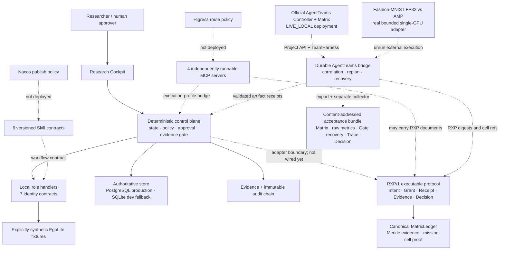

# Architecture

EgoAgentOS ResearchOps turns embodied-AI experimentation into a governed production
workflow. The architecture deliberately separates collaborative reasoning from
authoritative state and deterministic verification.

Solid arrows are the shipped local runtime. Dashed arrows are integration contracts or
an optional execution profile; they are not evidence that an external service is live.

## RXP/1 experiment acceptance plane

[`RXP/1`](protocols/RXP.md) is a shipped, executable, transport-independent reference
protocol. It freezes a complete experiment matrix and enforces, per cell, the causal
chain `Intent → one-time Grant → Receipt → Evidence → independent Decision`. Its
`MatrixLedger` commits evidence with a Merkle root, extends an append-only event root,
and lists every expected cell without a Decision. It does not replace MCP tool access,
Agent communication, Skill instructions, PROV-O, or experiment trackers.

The current FastAPI judge replay continues to use `approval-token-v1`; it is **not yet
wired to persist RXP documents**. Integration is explicit: an orchestrator creates RXP
documents around an execution adapter, transports their canonical JSON over MCP/A2A or
files, stores artifact bytes by digest, and checkpoints ledger roots in an authoritative
store. A one-way adapter can migrate an already validated-and-consumed `egoap1` token
into a fresh RXP Grant without treating the two formats as wire-compatible.

## Deterministic core, model residual

The deterministic core owns schema validation, state transitions, concurrency version,
risk classification, approval scope, idempotency, metric computation, canonical hashing,
evidence completeness, decision authorization, and memory-candidate promotion. An LLM or
Agent may interpret a goal, propose a hypothesis, explain metrics, or draft a review; it
cannot mutate these invariants.

## Shipped local control and data flow

1. The PI freezes natural-language intake into a versioned `ResearchGoal` digest.
2. Deterministic stage handlers emit role-attributed, synthetic context and experiment
   artifacts under the seven machine-readable Agent identity boundaries.
3. Policy classifies the exact R2 action and pauses for a human approval bound to task
   generation, scope, action digest, expiry, and a one-time nonce.
4. The local executor records a canonical `RunManifest`; it does not claim a real GPU
   launch. The MCP tool plane can be tested separately and through its explicit bridge.
5. Evaluation computes paired metrics from raw synthetic samples. A separate Reviewer
   identity covers every non-review producer before the evidence gate can pass.
6. The gate authorizes the fixed local `KEEP`/`INCONCLUSIVE` decision path. The Memory
   Curator may append only a candidate; a separate deterministic validator binds the
   supporting evidence and promotes it to validated memory. A draft Skill candidate is
   still not a published Skill.

The optional AgentTeams profile is executable, rather than a role-label simulation. The
bridge creates a real Controller Project, applies the DAG through the Project Workflow
API, dispatches a versioned envelope to the Team Leader over Matrix, and observes
TeamHarness-backed task states and declared artifacts. A Worker result is accepted only
after task/project/trace/context correlation and artifact SHA-256 verification.

Conflict, revision, stale context, ACK timeout, or execution timeout trigger bounded
cancel/replacement/replan behavior. The pre-execution DAG is paused at R2; only a scoped
EgoAgentOS approval receipt can resume it. If an upstream mutation succeeds but Matrix or
a later recovery step fails, the bridge persists `COMPENSATION_REQUIRED` and fences the
Controller Project. The production bridge store uses a separate PostgreSQL URL for JSONB
checkpoints, events, and receipts; CAS, per-run advisory locks, append-only triggers, and
receipt uniqueness make concurrent restart/retry fail closed. SQLite remains the zero-service
developer fallback when the bridge PostgreSQL URL is blank. A fresh Controller workflow read
remains authoritative for collaboration state.

The judge-feedback workload adapter in [`../experiments/fashion_mnist_amp/`](../experiments/fashion_mnist_amp/)
defines a real Fashion-MNIST, TinyCNN, FP32-versus-AMP run on exactly one CUDA GPU. It freezes
the environment, approval receipt, AgentTeams/Matrix receipts, raw predictions, latency,
memory telemetry, independent review, and final Decision under explicit 900-second,
0.25-GPU-hour, and 100-MiB limits. [`../semifinal_acceptance/`](../semifinal_acceptance/)
recomputes the content-addressed bundle and rejects Matrix gaps, receipt reuse, forged origin,
trace/Decision drift, resource overrun, and incomplete recovery evidence. No official
AgentTeams-to-GPU execution is bundled, so a locally valid contract still reports
`CONTRACT_PASS_ORIGIN_UNVERIFIED` for the experiment origin.

The 2026-09-02 local profile captured real Controller/Manager health, an Active Team,
four Running Worker resources, a paused Project, Bridge connectivity, and 36 Matrix events
from four distinct Agent identities. This is `LIVE_LOCAL` collaboration-infrastructure
evidence, not a completed Project workflow, Skill invocation, fault/recovery scenario, or
physical-GPU experiment. See [`acceptance/live-local-2026-09-02.md`](acceptance/live-local-2026-09-02.md).

## Deployment profiles

- `local-sqlite`: API + Web + SQLite + filesystem artifacts + deterministic simulator.
  This is only the zero-service developer fallback, not the production data path.
- `local-postgres`: Docker Compose + PostgreSQL 16 + API + Web + optional AgentTeams bridge
  store. Real database integration tests verify transactions, concurrency, least-privilege
  roles/RLS, candidate-only memory writes, append-only ledgers, LISTEN/NOTIFY, CAS/advisory
  locks, restart recovery, and migration replay. This is the production architecture path,
  but it does not imply a cloud database was exercised.
- `agentteams` (opt-in executable profile): official AgentTeams deployment plus
  `apps/agentteams_bridge`; the 2026-09-02 loopback deployment passed Controller/Team/Worker/
  Matrix probes and remains paused before GPU dispatch.
- `platform` (target contract): PolarDB-PG-compatible DB, object storage, OTel collector,
  AgentTeams, Higress, and Nacos. A fail-closed preflight checks schema, roles, policies,
  topology and notification capabilities, but the current health API still reports external
  endpoints as `not_configured` or `configured_unverified`; it does not certify PolarDB or PITR.
- `lab`: platform profile plus the real Fashion-MNIST scheduler/GPU adapter and a trusted
  dataset root. The adapter is implemented; the external run remains unverified.

The local profile is a functioning control-plane path, not a static UI. The public GitHub Pages
build remains a static replay. The separate local stack can make real model calls and run the
official collaboration services, while the included EgoLite metrics remain deterministic
synthetic fixtures. The Fashion-MNIST adapter operates on real data/GPU only when explicitly
launched; no such launch is claimed by this repository snapshot.
