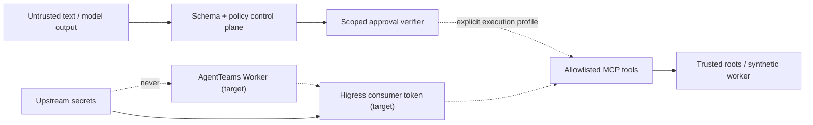

# Security model

## Assets and trust boundaries

Protected assets include upstream credentials, research code, datasets, checkpoints,
raw metrics, approval authority, evidence bytes, and the active configuration pointer.
Untrusted inputs include user goals, retrieved text, Matrix chat, model output, repository
content, tool output, and uploaded Skill packages.

Solid edges are exercised locally. Dashed edges are deployment boundaries and are not
reported as live by the default Web replay.

## Risk policy

| Level | Examples | Authorization |
|---|---|---|
| R0 | read repo/log/metric, evaluate fixtures | automatic + audit |
| R1 | single GPU, ≤2 GPU-hour, sandbox-only mutation | policy record + audit |
| R2 | multi-GPU/expensive run, large code/data mutation | human approval |
| R3 | delete, push main, publish model, deploy, irreversible API | human approval + rollback point + audit |

The control-plane approval record binds task generation, approver, exact action digest,
scope, expiry, and token hash. The GPU execution token contract additionally binds the
canonical launch payload. Both are single-use. A generic “approved” chat message has no
power.

## Operator API authentication

State-changing control-plane routes and executable Skill invocations require an explicit
`Authorization: Bearer` credential configured with `EGO_OPERATOR_KEY` (minimum 32 UTF-8
bytes). Comparison is performed on fixed-length SHA-256 digests with a constant-time
primitive, and the application retains only the configured key digest. Missing configuration
fails live mutations with `503`; missing and invalid credentials return `401` and `403`.
Health, dashboard, task/event reads, and side-effect-free RXP verification do not require this
operator credential. This deployment key is a service-level control and does not replace an
identity-aware ingress for a shared or public deployment.

`EGO_OPERATOR_ID` is the authoritative approval actor. The request model accepts `approver`
only as a compatibility assertion: omission is allowed, while a value different from the
authenticated identity is rejected. Thus an untrusted caller cannot choose the audit actor.
`EGO_ALLOW_UNAUTHENTICATED_DEMO=true` is an explicit development-only exception restricted to
the labelled synthetic EgoLite mutation paths and the fixed `demo.operator` identity; it never
authorizes live-task mutations or Skill execution.

The AgentTeams bridge has a separate inbound trust boundary. Its POST routes require
`EGO_AGENTTEAMS_BRIDGE_OPERATOR_KEY` through the same fixed-length digest and constant-time
comparison pattern; health and GET-only evidence exports remain public. Missing configuration,
missing credentials, and invalid credentials fail with `503`, `401`, and `403`. This key must be
generated independently from the outbound Ego API `EGO_OPERATOR_KEY`; configuring equal values
is rejected instead of silently reusing authority across the two directions.

For live approvals, the raw single-use token is absent from JSON and is delivered only on the
first successful response in `X-Ego-Approval-Token`. That response carries `Cache-Control:
no-store`, `Pragma: no-cache`, and `Referrer-Policy: no-referrer`; idempotent replays contain no
raw token and no token header. The synthetic browser demo retains JSON delivery solely on its
explicit compatibility path. Operators must still configure proxies not to log authorization
or approval-token headers.

## Database namespace boundary

PostgreSQL RLS filters rows against the application-set `egoagentos.tenant_id` session GUC.
This is a trusted-application namespace boundary: it prevents accidental cross-namespace
access and fails closed when the application omits the tenant value. It is not adversarial
tenant isolation if a database credential is exposed, because a holder of that credential
can set the same session GUC. Deploy separate database credentials or databases for hostile
trust domains, or bind tenant identity through an authenticated database proxy whose clients
cannot choose the GUC directly.

## Tool constraints

- Entrypoints are enums mapped to administrator-owned programs.
- Arguments are arrays and execution uses `shell=false`.
- Config and data paths must resolve below trusted roots; symlink escape is rejected.
- GPU IDs, time, output destinations, and publication behavior cannot exceed approval.
- Idempotency keys prevent duplicate expensive actions.
- Tool annotations are metadata, never the authorization mechanism.
- Logs redact authorization headers, access keys, tokens, and configured secret patterns.

## Evidence integrity

Canonical SHA-256 binds code commit, configuration, dataset manifest, environment lock,
base model, and seed in the local `RunManifest`. Each local evidence record binds task,
generation, kind, producer, payload digest, and synthetic label. URI/byte-size/object
verification fields belong to the target artifact-store schema and are not fabricated in
the SQLite replay. Raw paired samples are retained in metric evidence; narrative
summaries cannot substitute for them.

Bridge run mutations are fenced by a persisted operation owner and expiry. Immediately before
each live Controller, Matrix, worker-lifecycle, or Ego API mutation, the store atomically asserts
and renews the current owner. Event and receipt writes lock/read the run and validate that owner
inside the same database transaction. Once another process takes over an expired lease, the stale
process cannot execute another external mutation or append audit data. The remaining
crash-after-effect window is explicit: an upstream idempotent effect can commit just before a
process crash and before its receipt write. Durable start reservations, stable idempotency keys,
fresh official workflow reads, and compensation checkpoints provide recovery; they do not turn
multiple databases and HTTP services into an exactly-once transaction.

## Threat tests

The test suite covers illegal transitions, approval absence/scope/expiry/replay, digest
tampering, non-independent review, missing evidence kinds, unknown entrypoints, path
traversal/symlink escape, shell injection strings, and secret redaction. A platform claim
is “verified” only when the corresponding live negative tests also pass.
