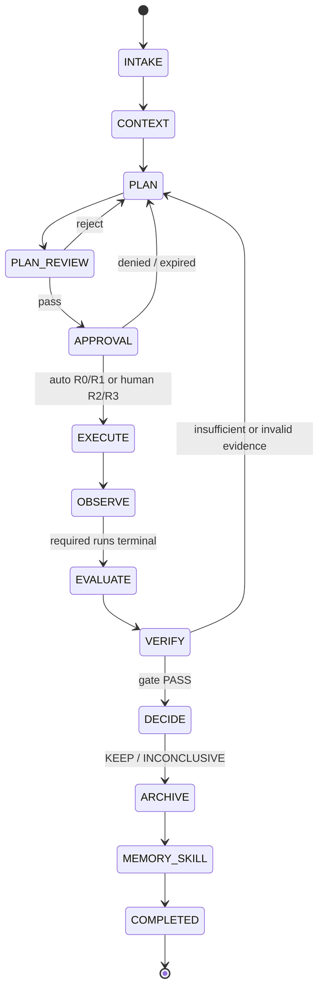

# Research state machine

Task stage and operational status are separate. A task can be `active`, `blocked`,
`cancelled`, or `completed` without inventing extra scientific stages. Runs have their
own queued/running/terminal status.

## Invariants

- Only the control-plane transition function can change `current_stage`.
- Every mutation uses one store transaction. PostgreSQL is the production path and combines
  optimistic versions with row/advisory locks and database-enforced append-only audit events;
  SQLite implements the same atomic contract only as the developer fallback. An executor
  failure rolls the approval consumption and stage claim back together.
- `PLAN → DONE`, `APPROVAL → DECIDE`, and all other shortcuts are illegal.
- R2/R3 can leave APPROVAL only with a matching, unexpired, single-use approval.
- The shipped local OBSERVE stage records an explicitly synthetic terminal log fixture.
- VERIFY can enter DECIDE only with a PASS result from the configured gate version.
- A Decision binds the gate digest and metric snapshot.
- The Memory Curator may only append a candidate. A separate deterministic
  `memory-validator` can promote it to validated memory after binding the final Decision and
  evidence closure.

See backend tests for the allow/deny matrix and branch coverage.

The broader platform contract also reserves bounded recovery from OBSERVE and
`ITERATE`/audited `REVERT` after DECIDE. Those branches require versioned plan/run
ownership and a real rollback executor, so this local replay does not present them as
implemented transitions.
